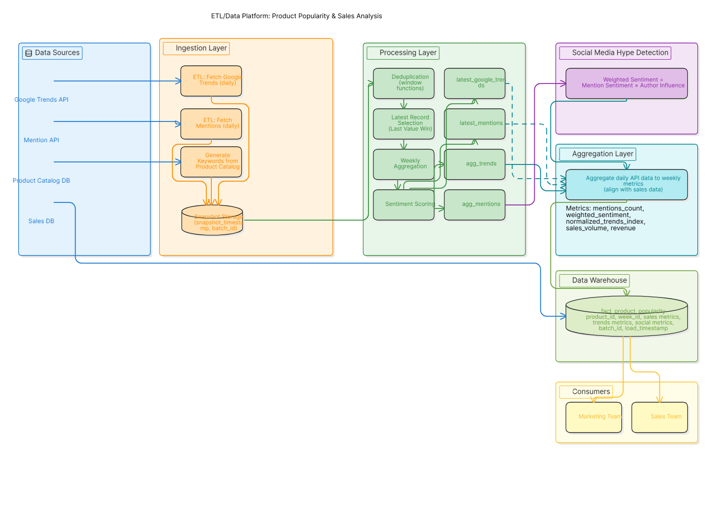
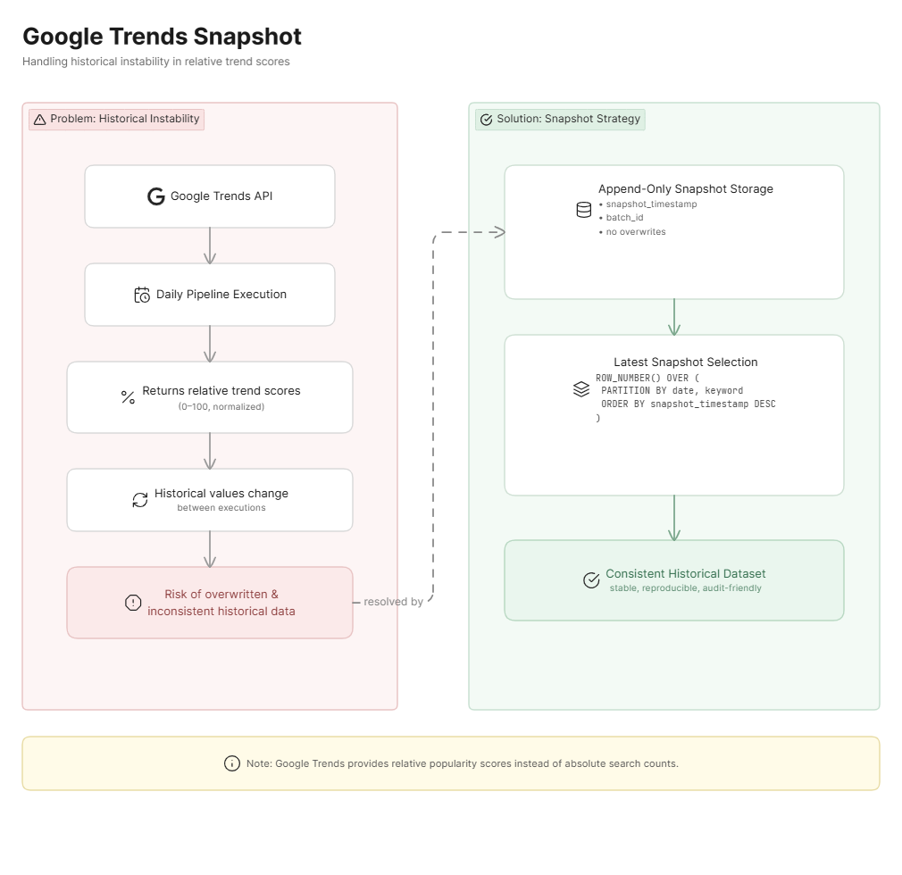
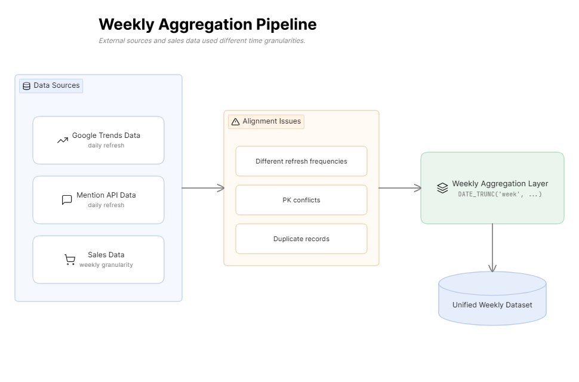
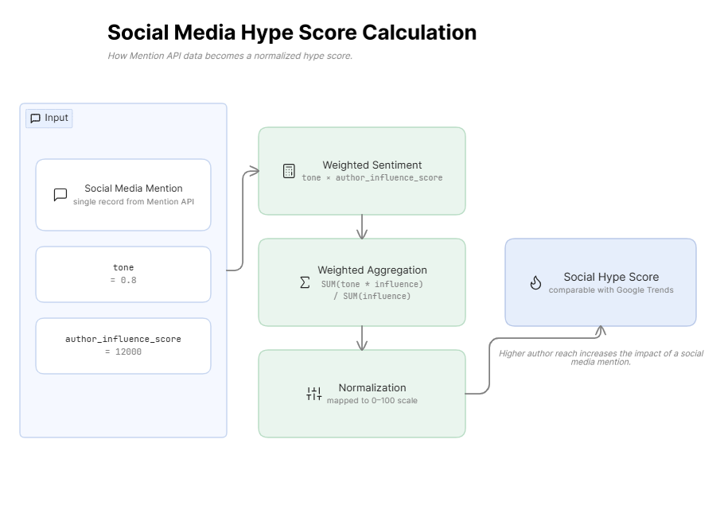

# Overview

Data pipeline project integrating external data sources (Google Trends, social media)
with sales data to analyze relationships between external product popularity metrics
and product sales based on historical data

The main source of inspiration for this project was the study **Evaluating the Impact of Social Media on Sales Forecasting: A Quantitative Study of the World's Biggest Brands Using Twitter, Facebook and Google Trends** by Olga Kolchyna.

## Use cases

Building a data system that leverages demand signals to support marketing and sales decision-making

The pipeline prepares data for analyzing:

**whether increased search interest impacts sales**

**how quickly sales grow after increased product interest is detected**

**which products can be predicted most accurately based on these external predictors**

The prepared data can be used to support marketing strategies,
demand analysis, campaign planning, and inventory management.

# Implementation

## Popularity Predictors
Increase in keyword search volume over a given time period Product mentions on social media

## Data Sources
### Mention API 
retrieves data about the number of social media mentions
### Google Trends 
retrieves data about keyword search interest growth in Google Search over a given time period

## Data Flow



## Data Challenges
### Historical Data Instability in Google Trends

Instead of providing the exact number of searches for a given keyword,
Google Trends uses a scale from 0 to 100, where 100 represents the peak popularity
of a term within a specific time period and region.
As a result, a pipeline running daily could overwrite data from previous iterations,
modifying historical values and causing data inconsistency.

### Solution:
During each ingestion pipeline run, data is not overwritten.
Instead, snapshots are created, and each snapshot contains a timestamp column,
allowing Google Trends data to be audited for a specific day.



Additionally, the keyword "Weather" is included in every pipeline iteration.
This keyword has a stable and high search volume and serves as an anchor
for normalizing the scale across different queries.

```sql
CREATE OR REPLACE VIEW latest_google_trends AS
SELECT *
FROM (
    SELECT *,
           ROW_NUMBER() OVER (
               PARTITION BY date, keyword, product_id
               ORDER BY snapshot_timestamp DESC
           ) rn
    FROM stg_google_trends_raw
) t
WHERE rn = 1;
```
```sql
raw_trends_index / NULLIF(anchor_keyword_index, 0)
    AS normalized_trends_index
```

### Mismatch Between Official Product Names and User Search Keywords

In the database, products have formally defined names that users do not necessarily
search for using the exact same wording.
The initially implemented exact keyword matching approach caused some search data
to be missed, resulting in underestimated search volume.

### Solution
To improve matching accuracy between official product names and user-entered search keywords,
the use of embeddings would be an effective solution.

### Aggregation of Daily Records into Weekly Intervals:
Data from Google Trends and the Mention API was collected daily, and both sources contained
daily statistics, while sales data was aggregated weekly.
Additionally, the two external sources had different refresh frequencies.
Initially, while loading data into tables, issues with duplicates and primary key conflicts occurred,
therefore the data was aggregated into a weekly calendar.



```sql
CREATE OR REPLACE VIEW agg_trends AS
SELECT
    week_date,
    product_id,

    AVG(raw_trends_index) AS raw_trends_index,
    AVG(anchor_keyword_index) AS anchor_keyword_index,
    AVG(normalized_trends_index) AS normalized_trends_index,

    MAX(batch_id) AS batch_id

FROM clean_trends
GROUP BY 1,2;
```

```sql
CREATE OR REPLACE VIEW agg_mentions AS
SELECT
    DATE_TRUNC('week', published_at) AS week_date,
    product_id,
    COUNT(*) AS mentions_count,
    SUM(tone * author_influence_score)
        / NULLIF(SUM(author_influence_score), 0) AS weighted_sentiment,
    AVG(author_influence_score) AS avg_author_influence
FROM latest_mentions
GROUP BY 1,2;
```

```sql
CREATE TABLE fact_product_popularity (
    week_id VARCHAR(10),
    product_id INT,

    sales_volume INT,
    revenue NUMERIC(12,2),

    mentions_count INT,
    weighted_sentiment FLOAT,
    avg_author_influence FLOAT,

    raw_trends_index FLOAT,
    anchor_keyword_index FLOAT,
    normalized_trends_index FLOAT,

    load_timestamp TIMESTAMP,
    batch_id VARCHAR(255),

    PRIMARY KEY (week_id, product_id)
);
```

### Social Media Hype Detection Through Mention Classification from the Mention API



Two attributes were used in mention classification: mention sentiment (tone)
and author reach (author_influence_score).
The author_influence_score attribute was used to estimate the author's reach —
the higher the author_influence_score, the higher the value assigned to the mention,
because the information about the product is more likely to reach a larger audience
and generate hype around the product.

The calculated sentiment score was then mapped to a 0–100 scale
to make it comparable with Google Trends metrics.

```sql
CREATE OR REPLACE VIEW agg_mentions AS
SELECT
    DATE_TRUNC('week', published_at) AS week_date,
    product_id,

    COUNT(*) AS mentions_count,

    (
        (
            SUM(tone * author_influence_score)
            / NULLIF(SUM(author_influence_score), 0)
        ) + 1
    ) * 50 AS weighted_sentiment,

    AVG(author_influence_score) AS avg_author_influence

FROM latest_mentions
GROUP BY 1,2;
```

## SQL Formulas
### Ingestion Layer

The pipeline periodically retrieves data from Google Trends and the Mention API
for previously defined keywords associated with products.
The keyword list is generated based on product catalog data from the store offering.

Data is stored as timestamped snapshots to preserve the historical consistency
of Google Trends data, along with a batch_id identifying the ETL process.

```sql
CREATE TABLE stg_google_trends_raw (
    id BIGSERIAL PRIMARY KEY,
    date DATE NOT NULL,
    keyword VARCHAR(255) NOT NULL,
    raw_trends_index FLOAT,
    anchor_keyword_index FLOAT,
    is_anchor_keyword BOOLEAN,
    snapshot_timestamp TIMESTAMP NOT NULL,
    batch_id VARCHAR(255)
);
```

```sql
CREATE OR REPLACE VIEW latest_google_trends AS
SELECT *
FROM (
    SELECT *,
           ROW_NUMBER() OVER (
               PARTITION BY date, keyword, product_id
               ORDER BY snapshot_timestamp DESC
           ) rn
    FROM stg_google_trends_raw
) t
WHERE rn = 1;
```

### Processing Layer

Since the data is retrieved through communication with external APIs,
the processing layer ensures data uniqueness even if the API returns
the same records multiple times.
Window functions were used to isolate the latest snapshot for each primary key
according to the Last-Value-Wins approach.

Each record contains metadata fields such as batch_id and snapshot_timestamp,
enabling traceability of every stage the data passed through before being loaded into the table.

```sql
CREATE OR REPLACE VIEW latest_google_trends AS
SELECT *
FROM (
    SELECT *,
           ROW_NUMBER() OVER (
               PARTITION BY date, keyword, product_id
               ORDER BY snapshot_timestamp DESC
           ) rn
    FROM stg_google_trends_raw
) t
WHERE rn = 1;
```

```sql
CREATE OR REPLACE VIEW latest_mentions AS
SELECT *
FROM (
    SELECT *,
           ROW_NUMBER() OVER (
               PARTITION BY mention_id
               ORDER BY snapshot_timestamp DESC
           ) rn
    FROM stg_mentions_raw
) t
WHERE rn = 1;
```